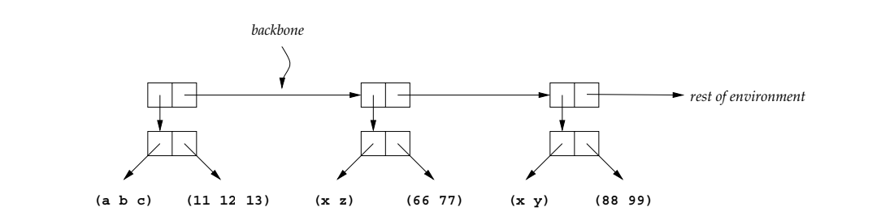
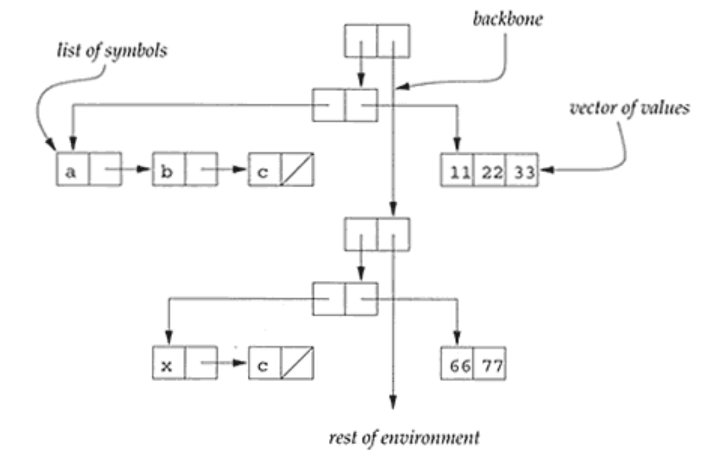

# Environment
If we are going to evaluate expressions containing variables,
we will need to know the value associated with each variable.
We do this by keeping those values in an **environment**.

An environment is a function whose domain is a finite set of
Scheme symbols and whose range is the denoted values.

The interface to environment data type has three procedures:
* empty-env
* extend-env
* apply-env

There are three representation strategies:
* Procedural representation
* Abstract syntax tree representation
* Alternative data structure representation

The ribcage representation is as follows:
```scheme
(define (empty-env)
  '())

(define (extend-env syms vals env)
  (cons (cons syms (list->vector vals)) env))

(define (apply-env env sym)
  (if (null? env)
      (eopl:error 'apply-env "No binding for ~s" sym)
      (let ((syms (car (car env)))
            (vals (cdr (car env)))
            (env (cdr env)))
        (let ((pos (list-find-position sym syms)))
          (if (number? pos)
              (vector-ref vals pos)
              (apply-env env sym))))))

(define (list-find-position sym los)
  (list-index (lambda (sym1) (eqv? sym1 sym)) los))

(define (list-index pred ls)
  (cond
    ((null? ls) #f)
    ((pred (car ls)) 0)
    (else
     (let ((list-index-r
            (list-index pred (cdr ls))))
       (if (number? list-index-r)
           (+ list-index-r 1)
           #f)))))
```


